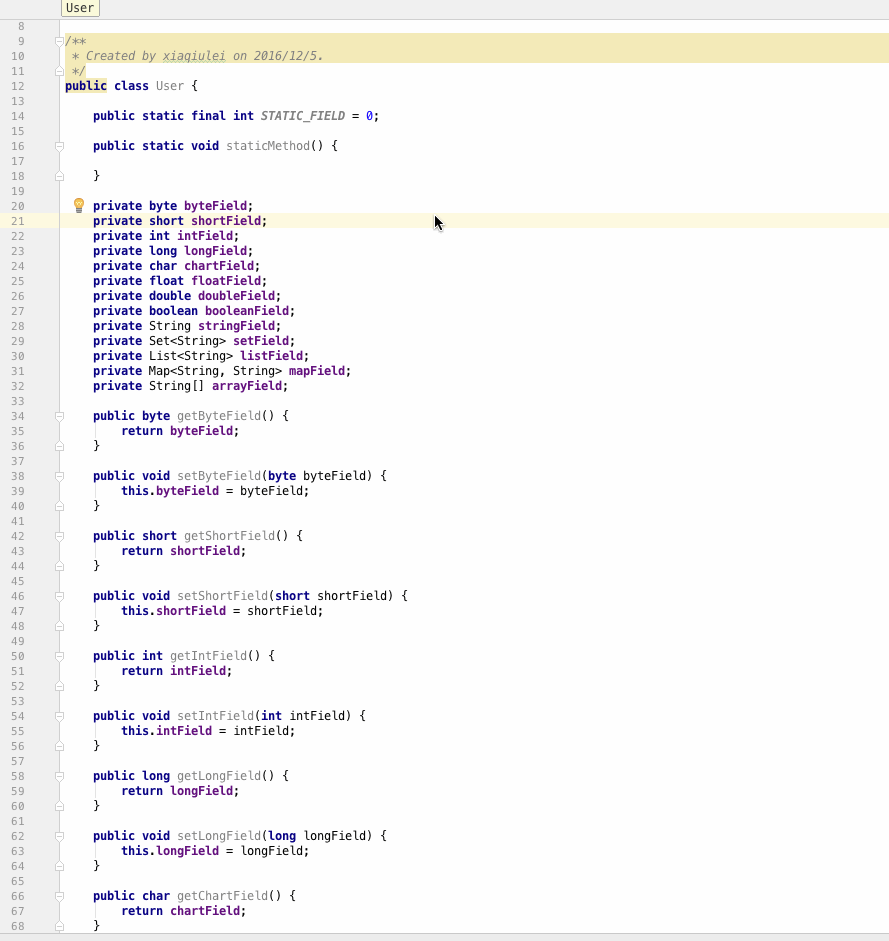

# AutoValue Convert

---

# 简介

一个简单的Android Studio插件 ，把一个普通的Java Model转化成AutoValue的形式。

关于AutoValue如何使用, 参见这里[Android Model正确使用姿势——AutoValue](https://github.com/LiushuiXiaoxia/AutoValueDemo) 。

如，一个普通的Java Model:

```xml
public class User {

    public static final int STATIC_FIELD = 0;

    public static void staticMethod() {

    }

    private byte byteField;
    private short shortField;
    private int intField;
    private long longField;
    private char chartField;
    private float floatField;
    private double doubleField;
    private boolean booleanField;
    private String stringField;
    private Set<String> setField;
    private List<String> listField;
    private Map<String, String> mapField;
    private String[] arrayField;

    public byte getByteField() {
        return byteField;
    }

    public void setByteField(byte byteField) {
        this.byteField = byteField;
    }

    public short getShortField() {
        return shortField;
    }

    public void setShortField(short shortField) {
        this.shortField = shortField;
    }

    public int getIntField() {
        return intField;
    }

    public void setIntField(int intField) {
        this.intField = intField;
    }

    public long getLongField() {
        return longField;
    }

    public void setLongField(long longField) {
        this.longField = longField;
    }

    public char getChartField() {
        return chartField;
    }

    public void setChartField(char chartField) {
        this.chartField = chartField;
    }

    public float getFloatField() {
        return floatField;
    }

    public void setFloatField(float floatField) {
        this.floatField = floatField;
    }

    public double getDoubleField() {
        return doubleField;
    }

    public void setDoubleField(double doubleField) {
        this.doubleField = doubleField;
    }

    public boolean isBooleanField() {
        return booleanField;
    }

    public void setBooleanField(boolean booleanField) {
        this.booleanField = booleanField;
    }

    public String getStringField() {
        return stringField;
    }

    public void setStringField(String stringField) {
        this.stringField = stringField;
    }

    public Set<String> getSetField() {
        return setField;
    }

    public void setSetField(Set<String> setField) {
        this.setField = setField;
    }

    public List<String> getListField() {
        return listField;
    }

    public void setListField(List<String> listField) {
        this.listField = listField;
    }

    public Map<String, String> getMapField() {
        return mapField;
    }

    public void setMapField(Map<String, String> mapField) {
        this.mapField = mapField;
    }

    public String[] getArrayField() {
        return arrayField;
    }

    public void setArrayField(String[] arrayField) {
        this.arrayField = arrayField;
    }

    @Override
    public boolean equals(Object o) {
        if (this == o) return true;
        if (o == null || getClass() != o.getClass()) return false;

        User user = (User) o;

        if (byteField != user.byteField) return false;
        if (shortField != user.shortField) return false;
        if (intField != user.intField) return false;
        if (longField != user.longField) return false;
        if (chartField != user.chartField) return false;
        if (Float.compare(user.floatField, floatField) != 0) return false;
        if (Double.compare(user.doubleField, doubleField) != 0) return false;
        if (booleanField != user.booleanField) return false;
        if (stringField != null ? !stringField.equals(user.stringField) : user.stringField != null) return false;
        if (setField != null ? !setField.equals(user.setField) : user.setField != null) return false;
        if (listField != null ? !listField.equals(user.listField) : user.listField != null) return false;
        if (mapField != null ? !mapField.equals(user.mapField) : user.mapField != null) return false;
        // Probably incorrect - comparing Object[] arrays with Arrays.equals
        return Arrays.equals(arrayField, user.arrayField);

    }

    @Override
    public int hashCode() {
        int result;
        long temp;
        result = (int) byteField;
        result = 31 * result + (int) shortField;
        result = 31 * result + intField;
        result = 31 * result + (int) (longField ^ (longField >>> 32));
        result = 31 * result + (int) chartField;
        result = 31 * result + (floatField != +0.0f ? Float.floatToIntBits(floatField) : 0);
        temp = Double.doubleToLongBits(doubleField);
        result = 31 * result + (int) (temp ^ (temp >>> 32));
        result = 31 * result + (booleanField ? 1 : 0);
        result = 31 * result + (stringField != null ? stringField.hashCode() : 0);
        result = 31 * result + (setField != null ? setField.hashCode() : 0);
        result = 31 * result + (listField != null ? listField.hashCode() : 0);
        result = 31 * result + (mapField != null ? mapField.hashCode() : 0);
        result = 31 * result + Arrays.hashCode(arrayField);
        return result;
    }

    @Override
    public String toString() {
        return "User{" +
                "byteField=" + byteField +
                ", shortField=" + shortField +
                ", intField=" + intField +
                ", longField=" + longField +
                ", chartField=" + chartField +
                ", floatField=" + floatField +
                ", doubleField=" + doubleField +
                ", booleanField=" + booleanField +
                ", stringField='" + stringField + '\'' +
                ", setField=" + setField +
                ", listField=" + listField +
                ", mapField=" + mapField +
                ", arrayField=" + Arrays.toString(arrayField) +
                '}';
    }
}
```

转化过就是这样,基本满足AutoValue使用：

```xml
@AutoValue
public abstract class User {

    public static final int STATIC_FIELD = 0;

    public static void staticMethod() {

    }

    @SerializedName("byteField")
    public abstract byte byteField();

    @SerializedName("shortField")
    public abstract short shortField();

    @SerializedName("intField")
    public abstract int intField();

    @SerializedName("longField")
    public abstract long longField();

    @SerializedName("chartField")
    public abstract char chartField();

    @SerializedName("floatField")
    public abstract float floatField();

    @SerializedName("doubleField")
    public abstract double doubleField();

    @SerializedName("booleanField")
    public abstract boolean booleanField();

    @Nullable
    @SerializedName("stringField")
    public abstract String stringField();

    @Nullable
    @SerializedName("setField")
    public abstract Set<String> setField();

    @Nullable
    @SerializedName("listField")
    public abstract List<String> listField();

    @Nullable
    @SerializedName("mapField")
    public abstract Map<String, String> mapField();

    @Nullable
    @SerializedName("arrayField")
    public abstract String[] arrayField();
}
```

# 操作示范



# 插件下载

[AutoValueConvert_v0.2.jar](https://github.com/LiushuiXiaoxia/AutoValueConvert/blob/master/AutoValueConvert_v0.2.jar)

# 后续优化

* 暂时没有

# 版本更新

* v0.1 支持基本转化功能


# 其他

* 这边有个 [Databinding的转化插件](https://github.com/LiushuiXiaoxia/DatabindingConvert) ,你可能需要?